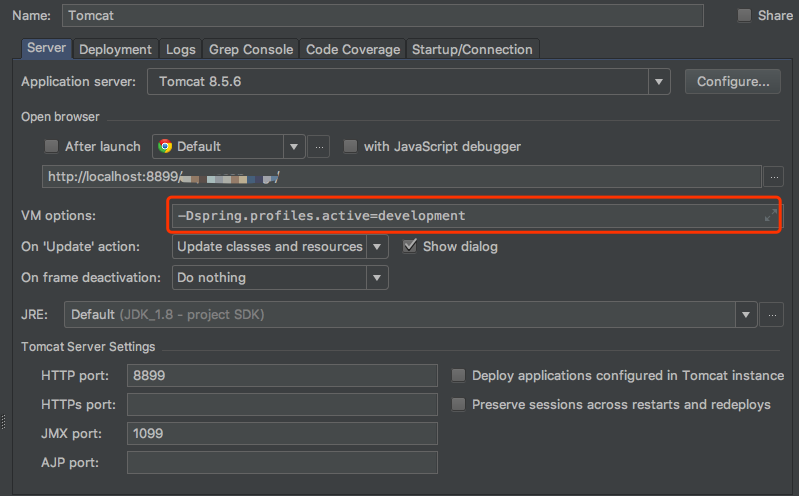

# Shark-Sharding
Shark Sharding 是基于 Spring MyBatis Druid 的分库分表 读写分离框架。

## Shark-Sharding 总体架构
Shark-Sharding采用应用集成模式，介于应用（Spring）和数据库组件（MyBatis）之间。

## Shark-Sharding与其他 Sharding 中间件的对比
Shark-Sharding 是我个人的学习之做，不是最好的 Sharding 中间件，但是在努力做到使用简单且稳定。

| 功能          | MyCat         |  Heisenberg   | Sharding-JDBC | Shark-Sharding |
| ------------- | ------------- | ------------- | ------------- | ------------- | 
| 是否开源       | 开源          | 开源           | 开源          | 开源           |
| 架构模型       | Proxy架构     | Proxy架构     | 应用集成架构    | 应用集成架构   |
| 数据库支持     | 任意          | 任意          | MySQL         | 任意，基于 Druid |
| 使用复杂度     | 一般          | 一般          | 一般          | 简单           |

# Shark-Sharding 快速入门
## 运行环境介绍
Shark-Sharding 默认分离三种运行环境：development / integratetest / production，分离三种运行环境可以使开发者的开发更加灵活。

### 环境变量的意义
 - 项目打出的包本身是需要适应任何环境的，开发者可以通过设置 spring.profiles.active 来控制当前的运行环境。
 - 通过环境变量来加载不同的 properties 配置文件。

如果当前 spring.profiles.active=development，那么会读取 src/main/resources/properties/development 路径下的 application-development.properties 文件

如果当前 spring.profiles.active=integratetest，那么会读取 src/main/resources/properties/integratetest 路径下的 application-integratetest.properties 文件

如果当前 spring.profiles.active=production，那么会读取 src/main/resources/properties/production 路径下的 application-production.properties 文件

如果当前是单元测试场景，那么会读取 src/test/resources/properties/application-test.properties 文件

### 如何设置运行时环境变量
**Tomcat 项目**
 - 修改 Tomcat 的 bin/catalina.bat 或者 bin/catalina.sh 文件：
        
        catalina.bat：增加 set JAVA_OPTS="-Dspring.profiles.active=development"
        catalina.sh：增加 export JAVA_OPTS="-Dspring.profiles.active=development"
 - 修改 IDEA 中 Tomcat 的 JVM 参数
 
    

    _NOTE_ | 如果没有设置 spring.profiles.active，默认为 production

**非 web 项目**
 - 在启动脚本中添加 jvm 参数：-Dspring.profiles.active=development 来做配置

## 示例演示
 我们必须先设计好业务的库表，这里会根据不同的场景，创建不同的数据库并提供 sql 脚本以供测试。

### 开发环境要求
    
    Spring 4.0+ ，JDK 1.8+ ，Tomcat 7+ 

### Shark-Sharding 测试入门
 **1. 创建一个简单的 Spring 工程**
 **2. Checkout Master 分支的源码到本地，执行 mvn install 安装到本地**

## 运行流程
### 数据源初始化流程
数据源初始化基于 <shark-sharding:matrix-datasource/> 标签，id 属性为 matrixDataSource 的名称，我们建议以 SDK 的方式命名。这样在逻辑概念上，我们认为一个组数据源，就是数据库操作的 SDK。

### 读写分离流程
### 分库流程
### 分表流程

## 使用方式
## TODO LIST
[
    {
        "groupName": "数据源组名称，分库时为分库shardkey",
        "loadBalance": "读写分离 LB 策略",
        "atoms": [
            {
                "atomName":"子数据源的名称，可以重复，主要用在针对不同数据库的连接池配置",
                "host": "数据库IP",
                "port": "数据库PORT",
                "dbName": "数据库名称",
                "username": "数据库用户名",
                "password": "数据库密码",
                "params": "数据库连接参数",
                "isMaster": true
            },
            {
                "atomName":"子数据源的名称，可以重复，主要用在针对不同数据库的连接池配置",
                "host": "数据库IP",
                "port": "数据库PORT",
                "dbName": "数据库名称",
                "username": "",
                "password": "",
                "params": "",
                "isMaster": false
            }
        ]
    }
]

相关概念：
matrixDataSource：复合数据源，逻辑概念，包括所有实际的数据源信息。
matrixName：复合数据源名称
groupName：数据源组的名称，里面包含了一个数据库的数据源信息。只有一个的时候，默认为 rwds，对应单库的读写分离。如果有多个，代表分库场景，分库时为分库shardkey。
atom：实际的数据源信息。创建数据源对象是，Bean Name：matrixName+"_" + groupName + MASTER/SLAVE(index)

## 设计思路
### matrixDataSource 复合数据源
在 Shark-Sharding 中，matrixDataSource是数据源的集合；一组读写分离数据源、分库+读写分离数据源，在整个框架中都是以matrixDataSource存在。基于自定义标签，可以对matrixDataSource中每一个原子的数据源进行连接池配置。这是为了实现针对不同的读写库，配置个性灵活的连接池配置。matrixDataSource的概念，可以将杂乱的数据源信息进行统一。便于数据源的管理配置，同时是框架读写分离，分库的基础。

### Sharding 策略设计
Shark-Sharding 并没有内置策略，这样的好处在于框架设计的简单，不涉及到 SQL 的解析过程，可以避免在这个过程中踩到难跳出来的坑。通过 RepositorySharding 和 TableSharding 注解中自定义 SpEL 表达式的解析，将分库分表的策略完全下放到业务方，业务方可以灵活的根据任何条件来进行 Shrding 策略的编写。在表达式中，执行 Java 静态方法，直接返回分库分表的 Sharding Key。框架寻找对应和分库数据源或者执行分表 SQL 的处理。

### 改写 Property PlaceHolder
Shark-Sharding 通过重写 PropertyPlaceholderConfigurer ，支持配置文件中使用 ${} 读取系统环境变量属性和根据 spring.profiles.active 读取指定环境的配置文件